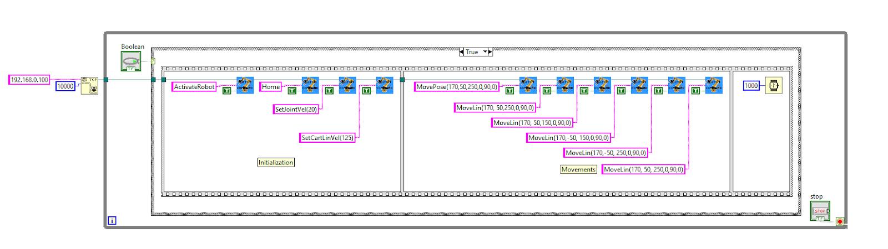
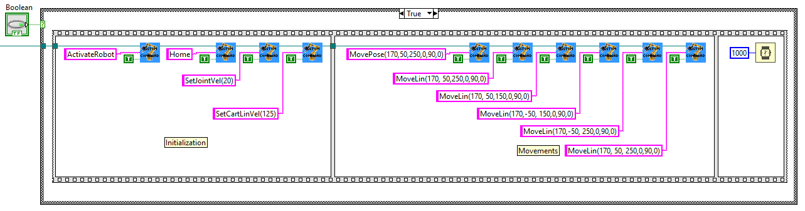
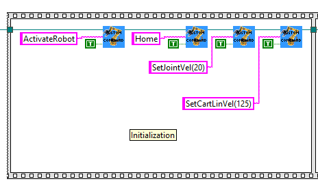
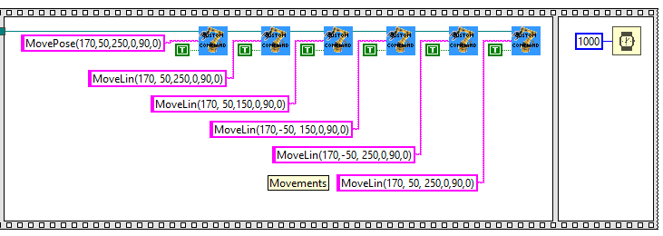

# LabVIEW Connection and Control for Meca500

TCP/IP communication example demonstrating robot control through LabVIEW's built-in networking capabilities.

## Prerequisites

- **LabVIEW software**
- **Meca500 robot** connected to network
- **Network Access**: Computer must be able to communicate with robot IP address
- **Robot Firmware**: Compatible firmware version

## Introduction

The Meca500 robot communicates primarily through TCP/IP communication. LabVIEW supports this type of communication and is fairly easy to use. The user simply has to build the messages and send them through the TCP write block function.

## TCP/IP Commands

### Controlling the Robot

The Meca500 robot can receive commands in the form of:
```
"Command(argument1, argument2, …)\x00"
```

The list of commands can be found in the [programming manuals](https://www.mecademic.com/support/) available on the Mecademic Support site. The `\x00` at the end is the null ASCII character that is used to signal to the robot that the command has ended.

Some commands return a value when the movement is complete, others can be immediate such as with a status request.

### Monitoring the Robot

The robot also has a monitoring port that sends info about the robot at a fixed rate. This port can be used to monitor various things on the robot such as the joint pose, end effector pose, and robot status.

Details can be found in the programming manual.

### Command Queuing

Depending on the type of application, the user might want to queue commands or send them only when needed. Both are possible with the Meca500.

If a command is sent before the previous one is completed, it is stored inside the internal queue of the robot and will be executed right after the previous command. This is true for most commands, except velocity control commands which are executed right away.

### TCP/IP in LabVIEW

In LabVIEW, there are TCP/IP communication blocks that enable simple communication. They can be found in the **Data Communication >> Protocols >> TCP** section of the function palette.

The main functions are:
- TCP Open Connection
- TCP Write
- TCP Read
- TCP Close Connection

A typical way to use these functions is to first open a connection to the robot. The default IP address is 192.168.0.100 and the control port is 10000. Then, with either a loop or a sequence, the write function is called to send commands to the robot. The write and read functions can be called as many times as needed once the connection has been opened.

One thing to note is that the connection must be kept open while the robot completes a command. For safety reasons, the robot will pause if the connection is broken or closed.

## SubVIs

For convenience, some subVIs have been created by us to facilitate the use of the Meca500 in LabVIEW. These subVIs can be used to send commands to the robot but do not monitor for a response. The subVIs are:

- CustomCommand
- MoveJoints
- MovePose
- MoveLin

These 4 subVIs can be used to create almost any program and can be modified if the user wants to add some functionalities. These subVIs always take as an input a TCP Connection, which is output from the TCP Open Connection block, and a Boolean input which serves as a trigger to send the command.

### CustomCommand

The custom command subVI simply allows the user to send any command that can be found in the programming manual. It simply concatenates the command with the `\x00` ending and sends it through the TCP Write block.

### MoveJoints/MovePose/MoveLin

These three commands take into inputs either a joint or TCP pose depending on the block. They simply take the inputs and add them to a string with the proper command and format and send them through the TCP Write block.

### Other Commands

The user can create their own subVIs for any command required. The only requirement is to follow the formatting from the Programming Guide.

## Program Example



This example is a simple program where a button is pressed and the robot is activated, homed, and then performs a predetermined move. If the button is pressed again, the robot goes through the cycle one more time.



This is the first section before the while loop opens the connection to the robot. The IP address is 192.168.0.100 and the port is the control port 10000. The connection is then sent inside the while loop.

The while loop is there to keep the connection alive until the user ends the program.

Inside the while loop, there is a case structure for when the button is pressed. This sequence structure is there for better readability and .



The first section of the sequence is the setup. Note that in the program, the CustomCommand subVI is used to send all commands to the robot. First the robot is activated and homed. These commands are necessary after booting up the robot so it is a good idea to always include them at the start of any program. If the robot is already activated and homed, these commands will be ignored by the robot so they can be repeated without causing any issue.

Then the joint and cartesian velocities are set. It is also a good idea to set the accelerations or any other global setting like blending or limits here before moving the robot. These settings can also be changed in the middle of a program if required.

The other section of the sequence contains the movements of the robot. Here the CustomCommand subVI is used again because these points are fixed and it is therefore simple to use the string command. The MoveLin and MovePose subVIs could have also been used but these are better suited for when the same command needs to be sent multiple times with positions that change every time. For instance, applications that use vision might be better suited for these subVIs.

Finally a time delay is added. This is necessary because if the communication breaks the robot stops moving. Note that this program works completely asynchronously and there is no feedback from the robot.

## Downloads

The following LabVIEW VI files are included in the [Downloads](./Downloads/) folder:

- **[DemoProgram.vi](./Downloads/DemoProgram.vi)** (15.4 KB) - Main demonstration program
- **[MoveJointsSubVI.vi](./Downloads/MoveJointsSubVI.vi)** (19.9 KB) - Joint movement SubVI
- **[CustomCommandSubVI.vi](./Downloads/CustomCommandSubVI.vi)** (17.1 KB) - Custom command SubVI
- **[MovePoseSubVI.vi](./Downloads/MovePoseSubVI.vi)** (19.9 KB) - Pose movement SubVI
- **[MoveLinSubVI.vi](./Downloads/MoveLinSubVI.vi)** (20 KB) - Linear movement SubVI

## Safety Warnings

⚠️ **Robot Movement**: This example will cause physical robot movement. Ensure:
- Clear workspace around robot
- Emergency stop accessible
- Robot is properly secured
- Personnel are at safe distance

⚠️ **Connection Requirements**: Keep TCP connection open during robot operation to prevent safety stops.

## Network Configuration

- **Default IP Address**: 192.168.0.100
- **Control Port**: 10000
- **Monitoring Port**: 10001

## Support

For additional support and documentation:
- [Mecademic Support Portal](https://www.mecademic.com/support/)
- [Programming Manual](https://www.mecademic.com/support/)