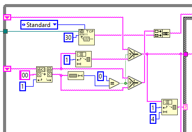
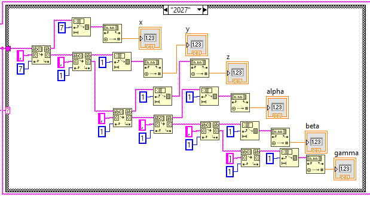

# LabVIEW Monitoring for Meca500

Robot status monitoring and data display using LabVIEW's TCP/IP communication with the Meca500 monitoring port.

## Prerequisites

- **LabVIEW software**
- **Meca500 robot** connected to network
- **Network Access**: Computer must be able to communicate with robot IP address
- **Robot Firmware**: Compatible firmware version
- **Recommended**: Review [LabVIEW Connection and Control](../LabVIEW%20Connection%20and%20Control/) example first

## Overview

In the [previous article](../LabVIEW%20Connection%20and%20Control/), sending commands to the robot was explained. This article explains how to use the monitoring port to get information about the robot and display it on a LabVIEW front panel.

## Meca500 Monitoring Port

As mentioned in the previous article, commands can be sent to the robot through port 10000. To monitor the status of the robot however, port 10001 is used. While only one connection to the control port can be created at any time, many connections to the monitoring port can be created simultaneously.

The robot sends information to the monitoring port at a fixed rate. The default delay is 15ms but can be changed using the command `SetMonitoringInterval(n)`. The information sent to the port is:

```
[2016][θ1, θ2, θ3, θ4, θ5, θ6]
[2017][x, y, z, α, β, γ]
[2007][as, has, sm, es, pm, eob, eom]
```

Again, every message sent by the robot ends with the ASCII null character `\x00`.

## String Handling in LabVIEW

To get the status of the robot from the monitoring messages, some string handling is required. The big challenge here is that the messages are not of fixed length and the TCP Read doesn't allow searching for a specific end of line character. The strategy to extract the messages and contents is:

1. Use the TCP Read function with a relatively small number of bytes to read. In the example 30 bytes are used.

2. Concatenate the new message with the previous one. This is because the message will not be complete after one read action and even when a message is complete, there is usually some left over data that is part of the next message.

3. Then search for the character `\x00` in the string. Here two things can happen:
   - If the character is found, everything before it is passed along to be parsed. This is a complete message. Anything after the character is part of the next message and is then passed to be concatenated with the next message.
   - If no character is found, the string is passed on to be concatenated with the next one.

4. Select which string to parse:
   - If no new message is passed along to be parsed, the previous one is used
   - If a new message is passed, it is used instead of the previous one

5. Find the message code by checking the 4 characters that appear after the first bracket. This is fixed length so it is easy to do with LabVIEW's string handling functions.

6. The message code is sent to a case structure as well as the whole message.

7. For every code, the data is extracted in the same way, only the quantity of data points changes.

8. Search for a "," character in the string starting with an offset of 7. The offset is the brackets and code.

9. Everything after is fed to the next search function and step 8 is repeated with an offset of 1 instead of 7.

10. All the values extracted are displayed on the front panel.

## Program Example


### Connection

The connection is created outside the while loop and port 10001 is used. The default IP address is 192.168.0.100.

### TCP Read and Message Extraction



This section might look a bit complicated but this is because some LabVIEW functions behave in a very specific way and blocks need to be added to make it work the way needed.

This section corresponds to steps 2-4 described earlier where the TCP port is read and the message is extracted.

### Message Parsing



The message parsing is fairly simple as it is a cascade of search functions and data conversion functions. For each code number, the message is parsed the same way but with different outputs. An empty "Default" case is also added for the codes that don't need to be managed.

## Conclusion

Monitoring the Meca500 robot in LabVIEW can be useful when creating most front panels. For instance if a jogging panel needs to be created, the monitoring is very useful to know if the robot approaches the limits of the joints. It can be a bit difficult to create since the string handling in LabVIEW is not the easiest thing to do, but as shown in this example, it is doable with a little bit of work.

## Downloads

The following LabVIEW VI file is included in the [Downloads](./Downloads/) folder:

- **[MonitoringDemo.vi](./Downloads/MonitoringDemo.vi)** (25.7 KB) - Complete monitoring demonstration program

## Safety Warnings

⚠️ **Network Traffic**: Monitoring generates continuous network traffic. Ensure network capacity can handle multiple monitoring connections if needed.

⚠️ **Connection Management**: Properly close monitoring connections when not needed to avoid resource consumption.

## Network Configuration

- **Default IP Address**: 192.168.0.100
- **Monitoring Port**: 10001
- **Default Update Rate**: 15ms (configurable via `SetMonitoringInterval(n)`)

## Message Codes Reference

| Code | Description | Data Format |
|------|-------------|-------------|
| 2016 | Joint Angles | θ1, θ2, θ3, θ4, θ5, θ6 |
| 2017 | Cartesian Pose | x, y, z, α, β, γ |
| 2007 | Robot Status | as, has, sm, es, pm, eob, eom |

## Support

For additional support and documentation:
- [Mecademic Support Portal](https://www.mecademic.com/support/)
- [Programming Manual](https://www.mecademic.com/support/)
- [LabVIEW Connection and Control Example](../LabVIEW%20Connection%20and%20Control/)