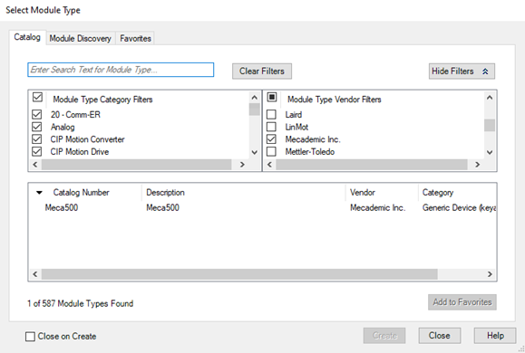

# Allen-Bradley CompactLogix PLC Add-On Instructions

This comprehensive guide provides everything needed to integrate Mecademic robots (Meca500 and MCS500) with Allen-Bradley CompactLogix PLCs using Add-On Instructions (AOI) in Studio 5000. The Add-On Instructions simplify robot integration with Rockwell PLCs by providing a standardized interface that mirrors the robot's TCP/IP command interface, using the Ethernet/IP protocol for seamless communication and control.

## Table of Contents

- [Downloads](#downloads)
- [Requirements](#requirements)
- [Step-by-Step Setup Instructions](#step-by-step-setup-instructions)
- [Programming with Add-On Instructions](#programming-with-add-on-instructions)
- [Programming Best Practices](#programming-best-practices)
- [Troubleshooting](#troubleshooting)
- [Technical Specifications](#technical-specifications)
- [Additional Resources](#additional-resources)
- [License and Legal](#license-and-legal)

---

## Downloads

### MCS500

#### MCS500 Firmware Version 10.2.x
- **[MCS500_V10_2_0_AB_EIP (SFC sequence)](https://hs.mecademic.com/hubfs/Support%20Knowledge%20Base/Programming%20Examples/PLC%20Examples/Allen-Bradley%20CompactLogix%20PLC%20Add-On%20Instructions/MCS500/MCS500_V10_2_0_AB_EIP.acd)** - Project file, Studio 5000 v30
- **[MCS500_AOI_V10_2](https://hs.mecademic.com/hubfs/Support%20Knowledge%20Base/Programming%20Examples/PLC%20Examples/Allen-Bradley%20CompactLogix%20PLC%20Add-On%20Instructions/MCS500/MCS500_AOI_V10_2.L5X)** - Add-On Instruction Only

#### MCS500 Firmware Version 10.1.x
- **[MCS500_V10_1_0_AB_EIP (SFC sequence)](https://hs.mecademic.com/hubfs/Support%20Knowledge%20Base/Programming%20Examples/PLC%20Examples/Allen-Bradley%20CompactLogix%20PLC%20Add-On%20Instructions/MCS500/MCS500_V10_1_0_AB_EIP.acd)** - Project file, Studio 5000 v30
- **[MCS500_AOI_V10_1](https://hs.mecademic.com/hubfs/Support%20Knowledge%20Base/Programming%20Examples/PLC%20Examples/Allen-Bradley%20CompactLogix%20PLC%20Add-On%20Instructions/MCS500/MCS500_AOI_V10_1.L5X)** - Add-On Instruction Only

---

### Meca500

#### Meca500 Firmware Version 10.2.x
- **[Meca500_V10_2_0_AB_EIP (SFC sequence)](https://hs.mecademic.com/hubfs/Support%20Knowledge%20Base/Programming%20Examples/PLC%20Examples/Allen-Bradley%20CompactLogix%20PLC%20Add-On%20Instructions/Meca500/Meca500_V10_2_0_AB_EIP.acd)** - Project file, Studio 5000 v30
- **[Meca500_AOI_V10_2](https://hs.mecademic.com/hubfs/Support%20Knowledge%20Base/Programming%20Examples/PLC%20Examples/Allen-Bradley%20CompactLogix%20PLC%20Add-On%20Instructions/Meca500/Meca500_AOI_V10_2.L5X)** - Add-On Instruction Only

#### Meca500 Firmware Version 10.1.x
- **[Meca500_V10_1_0_AB_EIP (SFC sequence)](https://hs.mecademic.com/hubfs/Support%20Knowledge%20Base/Programming%20Examples/PLC%20Examples/Allen-Bradley%20CompactLogix%20PLC%20Add-On%20Instructions/Meca500/Meca500_V10_1_0_AB_EIP.acd)** - Project file, Studio 5000 v30
- **[Meca500_AOI_V10_1](https://hs.mecademic.com/hubfs/Support%20Knowledge%20Base/Programming%20Examples/PLC%20Examples/Allen-Bradley%20CompactLogix%20PLC%20Add-On%20Instructions/Meca500/Meca500_AOI_V10_1.L5X)** - Add-On Instruction Only

#### Meca500 Firmware Version 9.3.x
- **[Meca500_V9_3_0_AB_EIP (SFC sequence)](https://hs.mecademic.com/hubfs/Support%20Knowledge%20Base/Programming%20Examples/PLC%20Examples/Allen-Bradley%20CompactLogix%20PLC%20Add-On%20Instructions/Meca500/Meca500_V9_3_0_AB_EIP.acd)** - Project file, Studio 5000 v30
- **[Meca500_AOI_V9_3](https://hs.mecademic.com/hubfs/Support%20Knowledge%20Base/Programming%20Examples/PLC%20Examples/Allen-Bradley%20CompactLogix%20PLC%20Add-On%20Instructions/Meca500/Meca500_AOI_V9_3.L5X)** - Add-On Instruction Only

#### Meca500 Firmware Version 9.1.x
- **[Meca500_V9_1_0_AB_EIP (SFC sequence)](https://hs.mecademic.com/hubfs/Support%20Knowledge%20Base/Programming%20Examples/PLC%20Examples/Allen-Bradley%20CompactLogix%20PLC%20Add-On%20Instructions/Meca500/Meca500_V9_1_0_AB_EIP.acd)** - Project file, Studio 5000 v30
- **[Meca500_AOI_V9_1](https://hs.mecademic.com/hubfs/Support%20Knowledge%20Base/Programming%20Examples/PLC%20Examples/Allen-Bradley%20CompactLogix%20PLC%20Add-On%20Instructions/Meca500/Meca500_AOI_V9_1.L5X)** - Add-On Instruction Only

#### Meca500 Firmware Version 8.4.x
- **[Meca500_V8_4_0_AB_EIP (SFC sequence)](https://hs.mecademic.com/hubfs/Support%20Knowledge%20Base/Programming%20Examples/PLC%20Examples/Allen-Bradley%20CompactLogix%20PLC%20Add-On%20Instructions/Meca500/Meca500_V8_4_0_AB_EIP.acd)** - Project file, Studio 5000 v30
- **[Meca500_AOI_V8_4](https://hs.mecademic.com/hubfs/Support%20Knowledge%20Base/Programming%20Examples/PLC%20Examples/Allen-Bradley%20CompactLogix%20PLC%20Add-On%20Instructions/Meca500/Meca500_AOI_V8_4.L5X)** - Add-On Instruction Only

#### Meca500 Firmware Version 8.3.x
- **[Meca500_V8_3_0_AB_EIP (SFC sequence)](https://hs.mecademic.com/hubfs/Support%20Knowledge%20Base/Programming%20Examples/PLC%20Examples/Allen-Bradley%20CompactLogix%20PLC%20Add-On%20Instructions/Meca500/Meca500_V8_3_0_AB_EIP.acd)** - Project file, Studio 5000 v30
- **[Meca500_AOI_V8_3](https://hs.mecademic.com/hubfs/Support%20Knowledge%20Base/Programming%20Examples/PLC%20Examples/Allen-Bradley%20CompactLogix%20PLC%20Add-On%20Instructions/Meca500/Meca500_AOI_V8_3.L5X)** - Add-On Instruction Only

---

## Requirements

### Hardware Requirements
- **[Meca500 Robot](https://www.mecademic.com/en/meca500-robot-arm)**
- **[CompactLogix or ControlLogix PLC](https://www.rockwellautomation.com/en-gb/products/hardware/allen-bradley/programmable-controllers/all-products.html)** (Version 26 or above)
- **Ethernet network connection** between robot and PLC

### Software Requirements
- **[Studio 5000 Software](https://www.rockwellautomation.com/en-za/products/software/factorytalk/designsuite/studio-5000.html)** (Version 26 or above)
- **[Robot Firmware](https://www.mecademic.com/en/downloads)** (Version 8.3.10 or above) 
- **[Mecademic EDS File](https://www.mecademic.com/en/downloads)** (Available in firmware folder)

### Network Requirements
- **Ethernet/IP communication** enabled on robot
- **Robot and PLC on same network segment** or routed connection
- **Robot IP address** configured and accessible from PLC

---

## Step-by-Step Setup Instructions

### Step 1: Enable Ethernet/IP on Robot

1. **Access Robot Web Interface**
   - Connect to robot via web browser using robot IP address

2. **Enable Ethernet/IP Protocol**
   - Send the following command via the web interface: `EnableEthernetIP(1)`
   - Configure IP settings if needed
   - Save settings and reboot robot if required

### Step 2: Install EDS File in Studio 5000

The first step in using your robot with Studio 5000 would be to install the EDS file provided by Mecademic.

1. **Download EDS File**
   - Download the Mecademic EDS file from the downloads section above

2. **Install EDS File**
   - Open Studio 5000 Logix Designer
   - Select the EDS Hardware Installation Tool from the Tools menu in Studio 5000
   - Browse and select the downloaded Mecademic EDS file
   - Follow the installation wizard steps to complete installation

### Step 3: Add Robot Module in Studio 5000

After installing the EDS file, you can add a new module in your Rockwell project.

1. **Create New Project or Open Existing**
   - Start Studio 5000 and create/open your PLC project

2. **Add Robot Module**
   - Right click on your Ethernet Port and select New Module
   - When adding the Module, you will be prompted to select the module type
   - Select the Meca500 robot from the available options

3. **Configure Module Properties**
   - After selecting the Meca500 Robot, enter the IP address and name the instance of your robot
   - The revision for the module definition should be set on 1.001
   - Set the Electronic keying on exact match or compatible keying
   - Communication settings: Use defaults unless specific requirements

4. **Verify Setup**
   - Download configuration to PLC
   - If the previous steps were done correctly, you should now be able to see the robot data structure in the controller tags of your project
   - Check I/O status to verify communication with robot

### Step 4: Import Add-On Instructions

1. **Download AOI File**
   - Download the appropriate AOI file for your robot model and firmware version

2. **Import AOI into Project**
   - In Studio 5000, right-click on "Add-On Instructions" in project tree
   - Select "Import Add-On Instruction"
   - Browse and select downloaded .L5X file
   - Complete import process

---

## Using the Add-On Instructions

The following Add-On instructions are provided by Mecademic to simplify the usage of the Meca500 with Rockwell PLCs.

These instructions will be mirroring the commands present in the TCP/IP interface to enable ease of use and standardize the programming structure between the Web Interface and in PLC programs (Ladder/ST/SFC) for Rockwell PLCs.

Follow the steps below to use the Add-On Instructions in Studio 5000.

1. **Select Command Block**
   - First, select the block that represents the command you want to send to your robot

2. **Populate Arguments**
   - Populate the argument(s) field with the values you want to send for the selected command
   - The command will be sent to the robot on the first scan of the block or when one of the argument(s) values are modified

3. **Real-time Updates**
   - If real-time updates are required, sending these instructions by updating the values should be the preferred method
   - However, it is recommended to update the values before enabling the blocks as this might give better control and prevent multiple instructions from being sent too rapidly if they are not all updated in the same scan

4. **Monitor Command Status**
   - Once the command has been sent, the sent bit from the block will become true and stay true until one of the arguments is modified or until the block is no longer enabled
   - The buffered bit will become true when the MoveID (Internal or External) of the last command received by the robot equals the MoveID of the command sent by the block
   - When the Buffered bit becomes True it is an acknowledgment from the robot controller that it has received the command and added it to FIFO command buffer queue

---

## Motion Commands and MoveID

The way that the robot can identify all of the different commands is with the motion command number. Each command has its own unique number. The internal MoveID values of the AOIs are closely related to the motion command values. Since the MoveID needs to be changed every time a new command is being sent to the robot, the add on instruction will alternate between two MoveIDs.

These two numbers will be constructed as such:

| Component | Value | Description |
|-----------|-------|-------------|
| **Prefix** | 32 | Fixed prefix for all MoveIDs |
| **Motion Command** | xx | Two-digit motion command number |
| **Alternating Bit** | 0/1 | Alternates between 0 and 1 for each command |

**Example**: Motion command 1 (MoveJoints) → MoveIDs 32010 and 32011

Below are all the commands, their motion command value and their internal AOI MoveID:

| Commands | Motion Command Value | AOI MoveID |
|----------|---------------------|------------|
| MoveJoints | 1 | 32010-32011 |
| MovePose | 2 | 32020-32021 |
| MoveLin | 3 | 32030-32031 |
| MoveLinRelTRF | 4 | 32040-32041 |
| MoveLinRelWRF | 5 | 32050-32051 |
| Delay | 6 | 32060-32061 |
| SetBlending | 7 | 32070-32071 |
| SetJointVel | 8 | 32080-32081 |
| SetJointAcc | 9 | 32090-32091 |
| SetCartAngVel | 10 | 32100-32101 |
| SetCartLinVel | 11 | 32110-32111 |
| SetCartAcc | 12 | 32120-32121 |
| SetTRF | 13 | 32130-32131 |
| SetWRF | 14 | 32140-32141 |
| SetConf | 15 | 32150-32151 |
| SetAutoConf | 16 | 32160-32161 |
| SetCheckpoint | 17 | 32170-32171 |
| Gripper | 18 | 32180-32181 |
| Gripper | 19 | 32190-32191 |
| GripperForce | 20 | 32200-32201 |
| MoveJointsVel | 21 | 32210-32211 |
| MoveLinVelWRF | 22 | 32220-32221 |
| MoveLinVelTRF | 23 | 32230-32231 |
| VelCtrlTimeout | 24 | 32240-32241 |
| SetConfTurn | 25 | 32250-32251 |
| SetAutoConfTurn | 26 | 32260-32261 |
| SetTorqueLimits | 27 | 32270-32271 |
| SetTorqueLimitsCfg | 28 | 32280-32281 |
| MoveJointsRel | 29 | 32290-32291 |
| SetValveState | 30 | 32300-32301 |
| SetGripperRange | 31 | 32310-32311 |
| MoveGripper | 32 | 32320-32321 |
| SetJointVelLimit | 33 | 32330-32331 |
| SetOutputState | 34 | 32340-32341 |
| SetOutputState_Immediate | 35 | 32350-32351 |
| SetIoSim | 36 | 32360-32361 |
| VacuumGrip | 37 | 32370-32371 |
| VacuumGrip_Immediate | 38 | 32380-32381 |
| VacuumRelease | 39 | 32390-32391 |
| VacuumRelease_Immediate | 40 | 32400-32401 |
| SetVacuumThreshold | 41 | 32410-32411 |
| SetVacuumThreshold_Immediate | 42 | 32420-32421 |
| SetVacuumPurgeDuration | 43 | 32430-32431 |
| SetVacuumPurgeDuration_Immediate | 44 | 32440-32441 |
| MoveJump | 45 | 32450-32451 |
| SetMoveJumpHeight | 46 | 32460-32461 |
| SetMoveJumpApproachVel | 47 | 32470-32471 |
| SetTimeScaling | 48 | 32480-32481 |
| StartOfflineProgram | 100 | 31900-31901 |

These unique MoveIDs are useful for troubleshooting and knowing which commands were received or not by the robot. It is also important to not use these internal MoveID when using the external MoveID feature of the AOIs.

**⚠️ Important**: To prevent communication problems, it is imperative to send one instruction at a time to a given robot.

We recommend to use a Grafcet like structure, where each step can only execute one instruction.

It is also recommended to only have one instance of an instruction per robot, this facilitate future program debugging.

---

## External MoveID

The external MoveID feature can be activated by setting the ExternalStateControl value to 1. When this is enabled, the user will need to input their own MoveID in the AOI. The commands will be sent only when the external MoveID value is updated to a new value as with the internal MoveID. This feature can be useful for users who want more in-depth control of their sequence and who want to monitor the commands sent and received by the robot more closely.

It should be noted that this approach needs a careful and thorough understanding of how the MoveID is being used in the robot controller and should only be used by more advanced users. It is also important to note that the values of the external MoveID should never be the same as the internal values of the AOI. If the user tries to input the same value as an internal value the error bit will become true on the AOI.

---

## Connect Block

The Connect AOI helps manage the connection of the robot to the PLC. This block can be really useful if you want to hand over the control connection to a PC. In the example below, if the ControlRobotBit is set to false, the PLC will disconnect the robot. You can then connect to the robot with a PC without removing any cables.

---

## Error Block

The RobotErrors AOI was created to help the user troubleshoot the robot errors. It interprets the error codes coming from the robot and returns a bit based on the error code. Those variables will stay true as long as the error code is present and will automatically turn to false when the errors are cleared.

---

**Please note that these examples are provided as-is by either Mecademic or its Partners. These can be used as starting point for development and testing but Mecademic or its partners are not under obligation to provide support and are not liable for any errors or unintended behavior caused by the examples. These examples could be updated over time.**
