# Omron Ethernet/IP Integration Guide
    
### Software

The purpose of this document is to guide the user in integrating a Mecademic Robot with Sysmac Studio. 

This guide and the examples that are in it were done with Sysmac Studio version 1.53 on a NX1P2-9024DT1 PLC.

  

### Installing the EDS file

**Proceed as follows:**

1\. In the Tools menu, select Ethernet/IP Connection Settings 
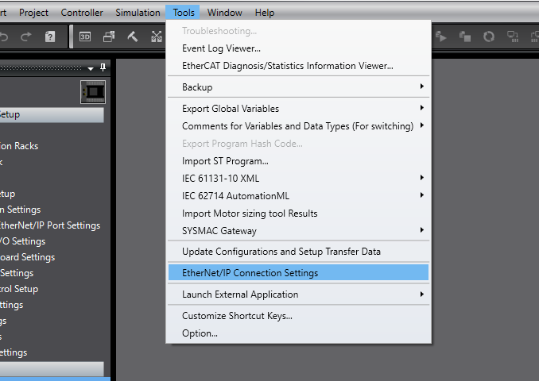

2\. Select the built-in EtherNet/IP Port Settings 
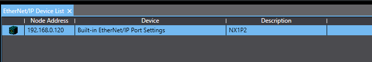

3\. In the toolbox, right-click and select Display EDS Library

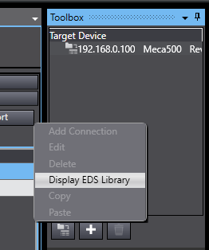

4\. Press the install button and select the EDS file from the firmware package available on our website.

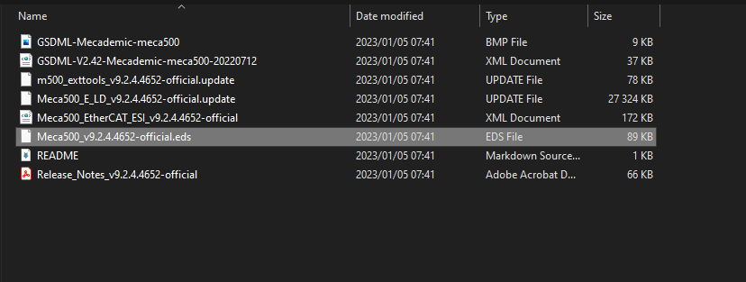

To configure the EtherNet/IP connection to the robot, you first need to create two variables to receive the data.

Mecademic has prepared a User Defined DataType for the robot, that you can use for the communication variables.

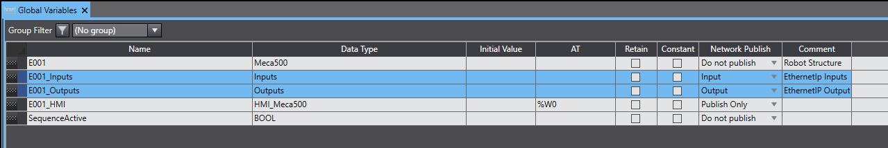

It is important to set the Network Publish configuration, to acces the variables when configuring the EtherNet/IP connection.

This is the expected result for the Communication Inputs:

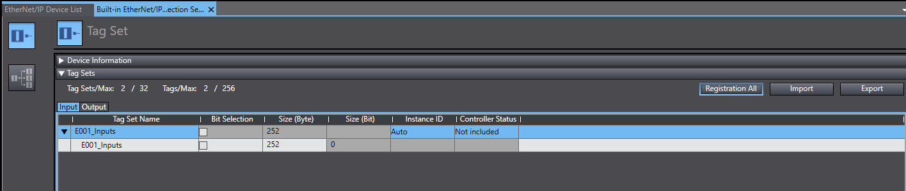

And for the Outputs:

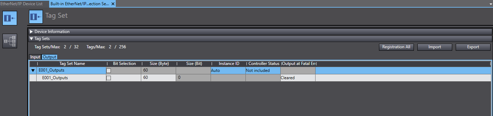

You can automatically assign the variables by pressing the button Registration All.

The resulting Connection will look like this:

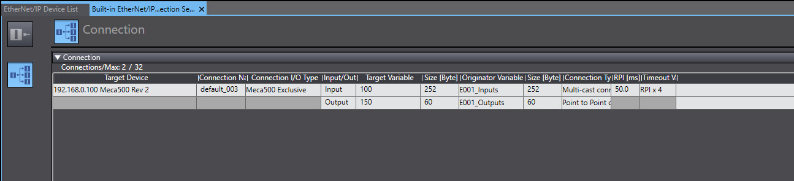

Prior to scanning your network in the Sysmac Studio environnement, the following command must be send to the robot on the web interface to enable the network configuration Ethernet/IP. 

In this example program, for ease of use, we have made available a Data type structure to facilitate the robot programming.

This is the robot declaration in the global variables:

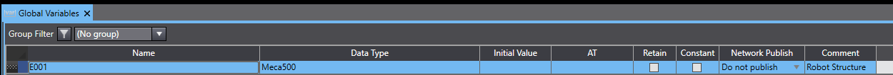

In the POUs section, under Programs, you will find the Program Meca500\_IOs. This program functionality is to pass the EtherNet/IP variables into the User-made structure. 

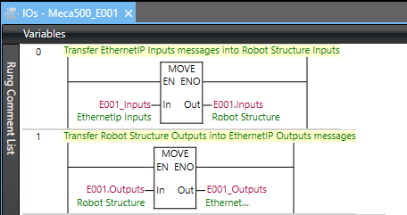

If you have multiple robots, this program needs to be edited to insert the corresponding variables.

### Using the Function Blocks

The following Function Blocks are provided by Mecademic to simplify the usage of the Meca500 with Omron PLCs.

These instructions will be mirroring the commands present in the TCP/IP interface to enable ease of use and standardize the programming structure between the Web Interface and in PLC programs.

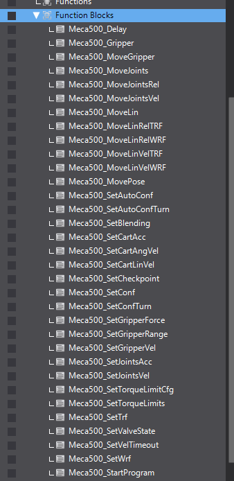\\

Follow the steps below to use the Function Blocks in Sysmac Studio.

First, select the block that represents the command you want to send to your robot.

Populate the argument(s) field with the values you want to send for the selected command. The command will be sent to the robot on the first scan of the block or when one of the argument(s) values are modified.

If real-time updates are required, sending these instructions by updating the values should be the preferred method. However, it is recommended to update the values before enabling the blocks as this might give better control and prevent multiple instructions from being sent too rapidly if they are not all updated in the same scan.

Once the command has been sent, the sent bit from the block will become true and stay true until one of the arguments is modified or until the block is no longer enabled.

The buffered bit will become true when the MoveID (Internal or External) of the last command received by the robot equals the MoveID of the command sent by the block. When the Buffered bit becomes True it is an acknowledgment from the robot controller that it has received the command and added it to FIFO command buffer queue.

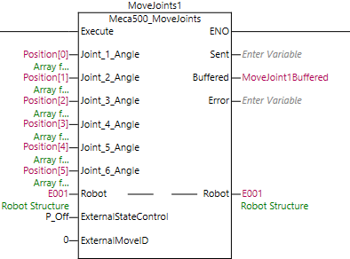 

To prevent communication problems, it is imperative to send one instruction at a time to a given robot. 

We recommend to use a Grafcet like structure, where each step can only execute one instruction.

It is also recommended to only have one instance of an instruction per robot, this facilitate future program debugging.

  

### Motion Commands and MoveID

test

The way that the robot can identify all of the different commands is with the motion command number. Each command has it's own unique number. The internal MoveID values of the Function Blocks are closely related to the motion command values. Since the MoveID needs to be changed every time a new command is being sent to the robot, the add on instruction will alternate between two MoveIDs.

These two numbers will be constructed as such :

|32    |xx            |0/1                      |
|------|--------------|-------------------------|
|Prefix|Motion command|Alternate between 0 and 1|

Below are all the commands, their motion command value and their internal Function Block MoveID:

|Commands           |Motion Command value|AOI MoveID  |
|-------------------|--------------------|------------|
|MoveJoints         |1                   |32010-32011 |
|MovePose           |2                   |32020-32021 |
|MoveLin            |3                   |32030-32031 |
|MoveLinRelTRF      |4                   |32040-32041 |
|MoveLinRelWRF      |5                   |32050-32051 |
|Delay              |6                   |32060-32061 |
|SetBlending        |7                   |32070-32071 |
|SetJointVel        |8                   |32080-32081 |
|SetJointAcc        |9                   |32090-32091 |
|SetCartAngVel      |10                  |32100-32101 |
|SetCartLinVel      |11                  |32110-32111 |
|SetCartAcc         |12                  |32120-32121 |
|SetTRF             |13                  |32130-32131 |
|SetWRF             |14                  |32140-32141 |
|SetConf            |15                  |32150-32151 |
|SetAutoConf        |16                  |32160-32161 |
|SetCheckpoint      |17                  |32170-32171 |
|Gripper            |18                  |32180-32181 |
|Gripper            |19                  |32190-32191 |
|GripperForce       |20                  |32200-32201 |
|MoveJointsVel      |21                  |32210-32211 |
|MoveLinVelWRF      |22                  |32220-32221 |
|MoveLinVelTRF      |23                  |32230-32231 |
|VelCtrlTimeout     |24                  |32240-32241 |
|SetConfTurn        |25                  |32250-32251 |
|SetAutoConfTurn    |26                  |32260-32261 |
|SetTorqueLimits    |27                  |32270-32271 |
|SetTorqueLimitsCfg |28                  |32280-32281 |
|MoveJointsRel      |29                  |32290-32291 |
|SetValveState      |30                  |32300-32301 |
|SetGripperRange    |31                  |32310-32311 |
|MoveGripper        |32                  |32320-32321 |
|StartOfflineProgram|100                 | 31900-31901|

These unique MoveIDs are useful for troubleshooting and knowing which commands were received or not by the robot. It is also important to not use these internal MoveIDs when using the external MoveID feature of the Function Block.

### External MoveID

The external MoveID feature can be activated by setting the ExternalStateControl value to 1. When this is enabled, the user will need to input their own MoveID in the AOI. The commands will be sent only when the external MoveID value is updated to a new value as with the internal MoveID. This feature can be useful for users who want more in-depth control of their sequence and who want to monitor the commands sent and received by the robot more closely.

It should be noted that this approach needs a careful and thorough understanding of how the MoveID is being used in the robot controller and should only be used by more advanced users. It is also important to note that the values of the external MoveID should never be the same as the internal values of the Function Blocks. If the user tries to input the same value as an internal value the error bit will become true on the Function Block.

__Please note that these examples are provided as-is by either Mecademic or it's Partners. These can be used as starting point for development and testing but Mecademic or it's partners are not under obligation to provide support and are not liable for any errors or unintended behavior caused by the examples. These examples could be updated over time.__

__This Exemple was developed with a Omron NX1P2 PLC for the Meca500 over EtherNet/IP__