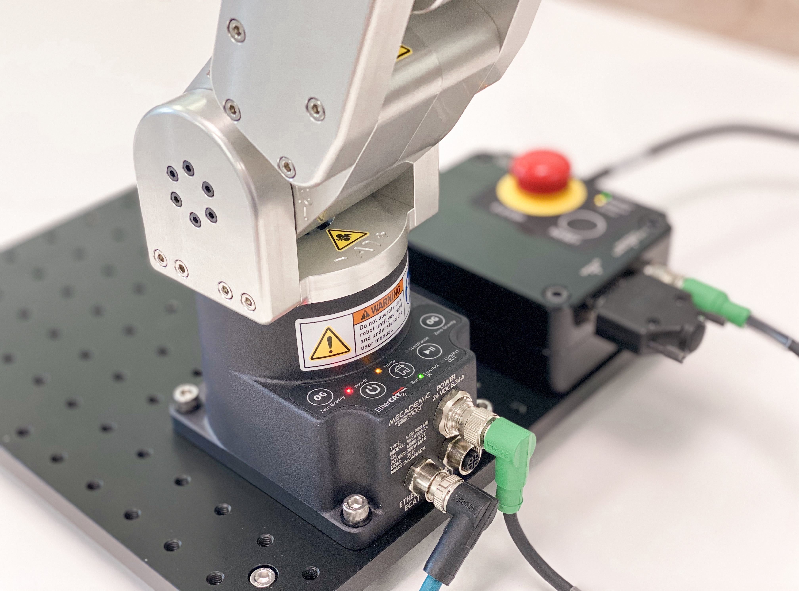

# TCP/IP Socket Communication with Meca500



The Meca500 uses TCP/IP socket communication over Port 10,000 to receive commands as ASCII strings, and to send its responses as ASCII strings as well. Each command must be appended with an ASCII NULL terminator. Commands sent without ASCII NULL will not be processed by the robot with the robot returning an error.

## Why TCP/IP Sockets?

### The advantages of the TCP protocol are:

- **Reliable**: packets dropped in the network are detected and retransmitted by the sender
- **In-order data delivery**: data is read by your application in the order it was written by the sender

By contrast, User Datagram Protocol (UDP) sockets are not reliable, and data read by the receiver can be out-of-order from the one written by the sender. Such networks are a best-effort delivery system. There is no guarantee that your data will reach its destination or that you will receive what has been sent to you.

Network devices (for example, routers and switches), have finite bandwidth available and their own inherent system limitations. They have CPUs, memory, buses, and interface packet buffers, just like clients and servers. Using TCP relieves you from having to worry about packet loss, data arriving out-of-order, and many other things that invariably happen when you are communicating across a network.

## Server / Client Communication

Communication with the robot over TCP/IP sockets follows the client/server relationship model. Here the robot acts as a TCP/IP server that accepts only one connection at a given time from one client. The client could be anything, a Python script, a C++ or C# Application, JavaScript running on a web browser, a PLC or an embedded system. Irrespective of the type of client, the fundamental concept of a TCP/IP communication between a server and a client is the same.


In this article we will explore the Client-Server TCP/IP communication using a Python socket module, specifically the client portion. The Python socket module provides an interface for working with TCP/IP sockets.

The client calls `connect()` to establish a connection to the server and initiate the three-way handshake. The handshake step is important since it ensures that each side of the connection is reachable in the network, in other words that the client can reach the server and vice-versa. It may be that only one host, client or server, can reach the other.

Once a connection has been established, data is exchanged between the client and the server using calls to `send()` and `recv()`. In the case of the robot, the client will call on `send()` to send the robot commands as ASCII strings and will call on `recv()` to receive the responses from the robot. After all the data exchanges are completed, the client calls `close()` to close the socket.

## Basic Connection Example (Python)

### Step 1: Create Socket Object

The first step is to create a TCP/IP socket object, which is needed to connect to the robot. The socket object "robot" is created as IPv4, TCP/IP type which is defined with `socket.AF_INET` and `socket.SOCK_STREAM` arguments respectively.

```python
#!/usr/bin/env python3
import socket
import time

ROBOT_IP = '192.168.0.100'  # IP address of the robot
ROBOT_PORT = 10000          # Port used by the robot to receive commands
robot = socket.socket(socket.AF_INET, socket.SOCK_STREAM)  # Create the socket object robot
```

### Step 2: Connect to Robot

The second step is to connect this socket object with the server (Robot), with the IP address and Port of the robot. The default values are "192.168.0.100" and 10,000. The `connect()` method of the socket class is used.

```python
robot.connect((ROBOT_IP, ROBOT_PORT))
```

### Step 3: Verify Connection

So far the socket has been created and we have connected it to the robot. To verify the connection, we now use the `recv()` method to read the data sent by the robot upon connection. If the robot accepted the connection, the response will be `[3000][Connected to Meca500 R3 v8.x.x.]` where v8.x.x is the firmware version. If the robot is already connected to a client, the `connect()` will return an error and the robot will respond with `[3001][Another user is already connected, closing connection.]`

```python
response = robot.recv(1024).decode('ascii')
print(response)
```

### Step 4: Send Commands

Once the connection has been established and verified, we can send a robot command and read its response.

```python
cmd = "ActivateRobot"  # Command to send to the robot
robot.send(bytes(cmd + "\\0", 'ascii'))  # Append ASCII NULL after the command and send as ASCII
time.sleep(10)
response = robot.recv(1024).decode('ascii')  # Read the response
print(response)
```

The robot should now activate and send the response `[2000][Motors activated.]` or `[2001][Motors already activated.]`. You could now use the `send()` method to send the commands and poll the responses with the `recv()` method after the command has been sent.

### Step 5: Close Connection

After all the commands have been executed you can close the connection using the `close()` method.

```python
robot.close()  # Close the socket
```

## Language-Specific Examples

This foundational TCP/IP communication concept applies to all programming languages. See language-specific implementations:

- **[Python Examples](../Python/)** - Including complete socket client examples
- **[C Examples](../C/basic-tcp-communication/)** - Low-level socket implementation
- **[LabVIEW Examples](../LabVIEW/)** - TCP/IP functions for connection and monitoring
- **[PLC Examples](../PLC/)** - Industrial controller integration

## Network Configuration

- **Default IP Address**: 192.168.0.100
- **Control Port**: 10000
- **Connection Limit**: One client at a time
- **Protocol**: TCP/IP (IPv4)

## Message Format

All commands must follow this format:
```
"Command(argument1, argument2, ...)\0"
```

Where `\0` is the ASCII NULL terminator.

## Connection Responses

| Response Code | Message | Description |
|---------------|---------|-------------|
| 3000 | Connected to Meca500 R3 v8.x.x | Successful connection |
| 3001 | Another user is already connected, closing connection | Connection rejected |
| 2000 | Motors activated | Command executed successfully |
| 2001 | Motors already activated | Command already completed |

## Safety Warning

⚠️ **Robot Movement**: TCP/IP commands can cause physical robot movement. Ensure workspace is clear and emergency stop is accessible before establishing connections.

## Support

For additional support and documentation:
- [Mecademic Support Portal](https://www.mecademic.com/support/)
- [Programming Manual](https://www.mecademic.com/support/)
- [Python Example - Simple TCP/IP Socket Client](../Python/TCP-Socket-Client/)